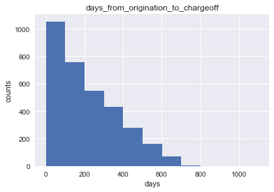
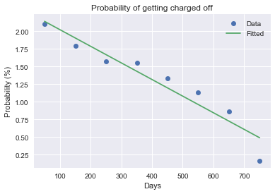

# Upstart Data Challenge

---

## Target: predict charge-off rate of loans

## Dataset description

Given 50,000 loans with two columns.

|Column                            | Description|
|:---------------------------------|:-----------|
|days since origination            |The number of days between the date that borrower receives money and the date that data was collected.|
|days from origination to chargeoff|The number of days between borrower receives money and the date the borrower stops making payment.|

## Inspect the dataset

After loading data into Pandas dataframe, we use `info()` method to check the information of the dataset.

```python
<class 'pandas.core.frame.DataFrame'>
RangeIndex: 50000 entries, 0 to 49999
Data columns (total 2 columns):
days since origination                50000 non-null int64
days from origination to chargeoff    3305 non-null float64
dtypes: float64(1), int64(1)
memory usage: 781.3 KB
```

This shows that 3305 loans became charge-off when the data collected. The current charge-off rate is $\frac{3305}{5000} \times 100\% = 6.61\%$. Because every loan has different starting date, there will be more loans having charge-off after their 3-year term finished.

Now I visualize the distribution of `days from origination to chargeoff`.



More than 1000 borrowers stop making payment in their first 100 days. And the number of charge-off decrease with time. For example, there are less than 200 people stop making payment in their 500 to 600 days. This means that if the borrower can make payment regually, then the they have lower possibility to get charge off.

Let me count the number of charge-off in 100 days interval.

|100 days interval|Number of charge-off|
|:----------------|-------------------:|
|1-100            |1053                |
|101-200          |758                 |
|201-300          |548                 |
|301-400          |432                 |
|401-500          |280                 |
|501-600          |162                 |
|601-700          |69                  |
|701-800          |3                   |

And I can count the number of borrowers in their Nth 100 days interval.

|100 days interval|Number of borrowers|
|:----------------|------------------:|
|1-100            |50000              |
|101-200          |42133              |
|201-300          |34851              |
|301-400          |27793              |
|401-500          |20947              |
|501-600          |14325              |
|601-700          |8002               |
|701-800          |1842               |

## Charge-off probability

Using the first table as numerator and second table as denomenator, I can calculate the charge-off probability in the 100 days interval and making the plot. And I can use a linear function to fit the probability distribution and extrapolate to days > 800.



The fitting function is $y = -0.002359 x + 2.260385$.

I can calculate the charge-off probabilities for 801-900, 901-1000, and 1001-1101 days.

Now I get the charge-off probability, I can count the number of borrowers in their 100 days interval since originate and calculate the number of charge-off after 3-years term finished using the formula:

\begin{equation}
N_{charge-off} = N_{borrower} \times \Pi_{i=1}^{10} (1 - Prob_{i}/100)
\end{equation}

|Days since originate|Number of borrowers|Probability no charge-off|Number of charge-off after 3-years term finished| 
|:-------------------|------------------:|------------------------:|----------:|
|1-100               | 6814              | 0.896917                |702.407174|
|101-200             | 6524              | 0.916212                | 546.629702|
|201-300             | 6510              | 0.932998                | 436.184801|
|301-400             | 6414              | 0.947903                | 334.152560|
|401-500             | 6342              | 0.962869                | 235.485043|
|501-600             | 6161              | 0.975914                | 148.393396|
|601-700             | 6091              | 0.987077                |78.715049|
|701-800             | 1839              | 0.995662                |7.977090 |

Summing all charge-off, there are 2490 borrowers stop making payments. So the charge-off rage is (2490+3305)/50000 * 100% = 11.59%