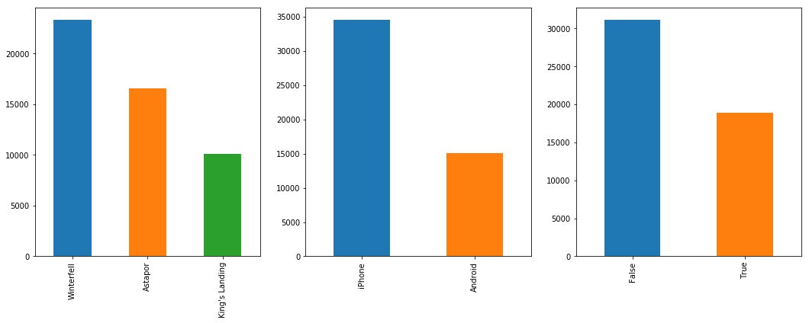
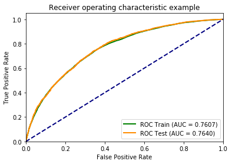
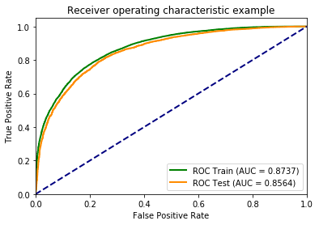
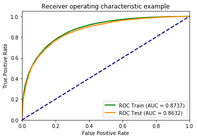
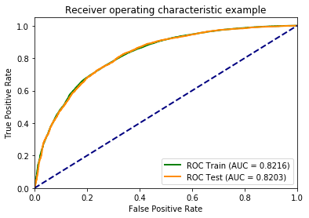

# Uber rider churn prediction
---
## Target: predict the rider churn rate (or rider retention)

## Dataset description

* The data contains 50,000 entries and 12 columns for each entries. The meaning of each column is described in the following table.

| Column                   | Description                  |
|:-------------------------|:-----------------------------|
| city                     | City this user signed up in  |
| phone                    | Primary device for this user |
| signup\_date             | Date of account registration; in the form ‘YYYY­MM­DD’|
| last\_trip\_date         | The last time this user completed a trip; in the form ‘YYYY­MM­DD’ |
| avg_dist                 | The average distance *(in miles) per trip taken in the first 30 days after signup |
| avg\_rating\_by\_driver  | The rider’s average rating over all of their trips |
| avg\_rating\_of\_driver  | The rider’s average rating of their drivers over all of their trips |
| surge\_pct               | The percent of trips taken with surge multiplier > 1 |
| avg\_surge               | The average surge multiplier over all of this user’s trips |
| trips\_in\_first\_30_days| The number of trips this user took in the first 30 days after signing up |
| luxury\_car\_user        | True if the user took an luxury car in their first 30 days; False otherwise |
| weekday\_pct             | The percent of the user’s trips occurring during a weekday |

## Inspect the dataset

After loading the dataset into Pandas, we have to inspect the dataset. Firstly, we can use the `info()` method to see three things:

* How many rows and columns exist in the data?
* Is there missing values?
* Is the type of data correct?

The output of the `df.info()` tells us

```python
<class 'pandas.core.frame.DataFrame'>
RangeIndex: 50000 entries, 0 to 49999
Data columns (total 12 columns):
avg_dist                  50000 non-null float64
avg_rating_by_driver      49799 non-null float64
avg_rating_of_driver      41878 non-null float64
avg_surge                 50000 non-null float64
city                      50000 non-null object
last_trip_date            50000 non-null object
phone                     49604 non-null object
signup_date               50000 non-null object
surge_pct                 50000 non-null float64
trips_in_first_30_days    50000 non-null int64
luxury_car_user           50000 non-null bool
weekday_pct               50000 non-null float64
dtypes: bool(1), float64(6), int64(1), object(4)
memory usage: 4.2+ MB
```
So we know there are 50,000 rows and 12 columns as expected. However, the `avg_rating_by_driver`, `avg_rating_of_driver`, and `phone` have missing values.
Furthermore, we can check how many missing values in each columns by 

```python
df.isnull().sum()

avg_dist                     0
avg_rating_by_driver       201
avg_rating_of_driver      8122
avg_surge                    0
city                         0
last_trip_date               0
phone                      396
signup_date                  0
surge_pct                    0
trips_in_first_30_days       0
luxury_car_user              0
weekday_pct                  0
dtype: int64

```

## Feature engineering

### Missing imputation

A lot of missing values in `avg_rating_by_driver` and `avg_rating_of_driver` columns, this is because not all the riders (or drivers) provide the rating to their drivers (or riders). The missing values in `phone` column mean the phone cannot be recognized.

There are two ways to handle the missing values:

1. drop the row which has missing values using `dropna()` method.
2. fill the missing values using `fillna()` method.

Here we adopt the second method. We use the median to fill the missing in `avg_rating_by_driver` and `avg_rating_of_driver` columns and use string `unknown` for the missing in `phone` column. 

### Transform data

The `last_trip_date` and `signup_date` are in object format, which is equivalent to string format. It would be better to convert the type into **datetime64** format by using `pd.to_datetime()`. The YYYYMMDD becomes YYYY-MM-DD in datetime64 format.

The date information might not very useful. We can imagine there are more riders to use Uber at weekend than the weekdays (or opposite way). So we need to retrieve the day-of-week information from date. The `dataofweek()` method of datetime64 object is what we need. It return 0 for Monday and 6 for Sunday. Although date of week looks like numerical data, they are **categorical data**.


If we do some exploratory data analysis (EDA) as shown in the above figure, then we will notice the `city`, `phone` and `luxury_car_user` are categorical data. We have to convert all the categorical data to **one-hot encoding**.

### Features

After applying missing value imputation and transform data to one-hot encoding, we have some new features for building models.

```python
Index(['avg_dist', 'avg_rating_by_driver', 'avg_rating_of_driver', 'avg_surge',
       'city', 'last_trip_date', 'phone', 'signup_date', 'surge_pct',
       'trips_in_first_30_days', 'luxury_car_user', 'weekday_pct',
       'signup_dayofweek', 'city_Astapor', 'city_King's Landing',
       'city_Winterfell', 'phone_Android', 'phone_iPhone', 'phone_unknown',
       'signup_dayofweek_0', 'signup_dayofweek_1', 'signup_dayofweek_2',
       'signup_dayofweek_3', 'signup_dayofweek_4', 'signup_dayofweek_5',
       'signup_dayofweek_6'],
      dtype='object')
```

## Define labels

The data were collected from 2014-01-01 to 2014-06-30. We can define the **churn** as _the riders don't use Uber in the passed 30 days_. Since the last date is 2014-06-30, we say that the rider is **churn**ed if he or she doesn't use Uber since 2014-06-01, otherwise the user is **active**.

After the label (churn) is defined, we can make EDA w.r.t label. In the figure, the blue dots mean churned and red dots means activate


## Save cleaned data

We don't want to lose the data which we have applied **data wrangling** (or called **data munging**) so we nedd to save the data into a new CSV file.

## Build models

Now we can use the cleaned dataset to build our models to predict the churn. Building models can be seperated into the following steps.

1. **Select features**: we have to select the appropriate features as predictors which are used to learn.
2. **Split data**: the dataset need to be divided into training dataset and testing dataset.
3. **Select algorithm**: This is the main part to learn from training dataset and predict the label of testing dataset
4. **Define metric**: How do we know our predictions are good or bad? We need to define what matrics are important for the predictions.

In this project, we use the following features to build our models. Notice all the selected features must be in **numerical** format. That is why we have to convert the categorical data into one-hot encoding.

```python
selected_features = ['avg_dist', 'avg_rating_by_driver', 'avg_rating_of_driver', 'avg_surge',
                     'surge_pct', 'trips_in_first_30_days', 'luxury_car_user', 'weekday_pct',
                     'phone_Android', 'phone_iPhone', 'phone_unknown',
                     'city_Astapor', "city_King's Landing", 'city_Winterfell']
```
And the dataset is divided into training and testing samples. Here we use 20% of the original dataset as testing samples.

Because we don't know which algorithm would perform better, we try to apply different algorithms and to compare their performances by checking their metrics.

### Algorithms

* Logistical regression
  * Logistical regression is easier to explain the model. 
* Single tree
* Bagged trees
* Single kNN
* Bagged kNN
* Random forest
* Gradient boosting trees
* Neural network
* Linear SVM
* Non-linear SVM
* We also apply the grid search on the random forest
  * Try to find the best parameters 

### Metrics

The main metric is **roc\_auc\_score**. However, we also compare _precision\_score_, _accuracy\_score_, _recall\_score_, and _f1\_score_. The ROC curves are drawn and AUC values are calculated and shown in the figure.

#### Results
Here we show the AUC values for different algorithm and different samples. 

| Algorithm                        | Training AUC | Testing AUC |
|:--------------------------------:|-------------:|------------:|
| Logistic regression              | 0.760681     | 0.764023    |
| Single tree                      | 0.914333     | 0.810793    |
| Bagged trees                     | 0.919577     | 0.853736    |
| Single kNN                       | 0.926971     | 0.771744    |
| Bagged kNN                       | 0.955025     | 0.798840    |
| Random forest                    | 0.873699     | 0.856362    |
| Gradient boosting trees          | 0.873722     | 0.863193    |
| Neural network                   | 0.821577     | 0.820328    |
| Linear SVM                       | 0.593032     | 0.594433    |
| Non-linear SVM                   | 0.620517     | 0.596075    |
| Grid search on the random forest | 0.894841     | 0.857255    |

From the table, we know

* Overfitting: single tree, bagged trees, single kNN and bagged kNN
* Good model: logistic regression, random forest, gradient boosting trees, and neural network
  * logistic regression has lower AUC
  * Random forest is a little bit overfit but still acceptable.
* Not a good model: linear and non-linear SVM

#### The ROC AUC curves for good model:
By comparing the ROC AUC curves, the gradient boosting trees has better performance but random forest seem also good.

##### Logistic regression:

##### Random forest:

##### Gradient boosting trees

##### Neural network

