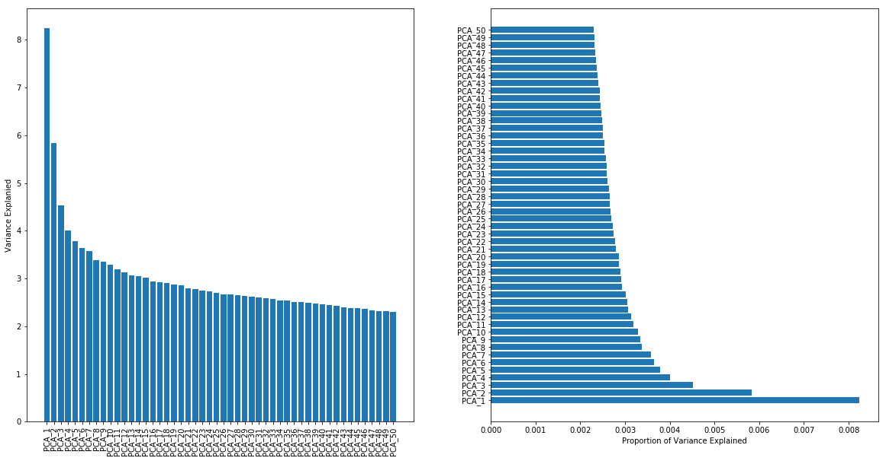
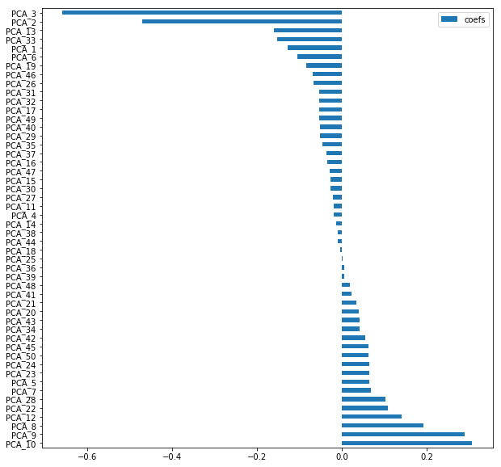
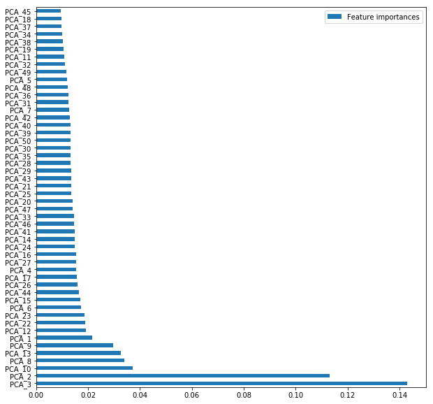

# Yelp data challenge round 12

---
## Target: Build restaurant recommender system

## Target: Sentiment analysis using the review text data and NLP techniques

---

## Dataset description

* The datasets are downloaded from [Yelp Dataset Challenge](https://www.yelp.com/dataset/challenge)
  * Round 12 has kicked off starting August 1, 2018 and will run through December 31, 2018.
* The dataset contains 6.8 GB unstructed text data in `json` format. 
* There are 6 files.
  * `yelp_academic_dataset_business.json`
  * `yelp_academic_dataset_photo.json`
  * `yelp_academic_dataset_tip.json`
  * `yelp_academic_dataset_checkin.json`
  * `yelp_academic_dataset_review.json`
  * `yelp_academic_dataset_user.json`


## Description of Jupyter Notebooks

* There are 4 Jupyter Notebooks for Yelp data challenge round 12.
* `Yelp_01_data_wrangling.ipynb`:
  * Apply the data preprocessing.
  * Load 6.8 GB Yelp data (json format) into Pandas dataframe.
  * Filter data by selecting useful information to reduce data size.
    * Only select the **restaurants** in **Las Vegas** for the analysis.
  * Combine business and review data
    * Only select the data have reviews in the **last 2 years** to avoid crush when running machine learning algorithms
  * Save the preprocessed results into a csv file. 
    * `selected_business.csv`
    * `last_2_years_restaurant_reviews.csv`: This file is 260 MB. Because the size is greater than 100 MB (upload limit of GitHub), I didn't upload this file to GitHub.
* `Yelp_02_clustering_and_PCA.ipynb`
  * Use the preprocessed results from `Yelp_01_data_wrangling.ipynb`
  * Apply clustering model with NLP to the reviews of restaurant.
  * Apply clustering model with NLP to the top reviewed restaurant.
  * Use PCA to reduce the dimension and try to fit the review documents using Logistic Regression and Random Forest.
  * Some Extra Credits.
* `Yelp_03_NLP.ipynb`
* `Yelp_04_restaurant_recommender_system.ipynb`


## Data preprocessing

* 讀取 json 檔案，只使用 business 和 reviews，把兩者做 inner merge，篩選出在 Las Vegas 的 restaurant，然後存成 csv 檔案。

* The input datasets are in `json` format. There are two ways to load a `json` file into Pandas dataframe.
  * Use `pandas.read_json()`
    * `read_json()` doesn't support nested `json`.
    * See [Flatten Nested JSON in Pandas
](https://www.kaggle.com/jboysen/quick-tutorial-flatten-nested-json-in-pandas)
  * Use `json.loads()`
    * I used `json.loads()` to load `json` files and put into Pandas dataframe.

```python
# Loading a single file works, wrap in function
def read_json_file(input_file):
    with open(input_file) as fin:
        df = pd.DataFrame(json.loads(line) for line in fin)
    return df
```

* I want to use the reviews to build recommender system, so only load business data and review data into dataframe.
  * There are many business in many places, I focus on restaurant in Las Vegas.
* Restaurant is in the categories field. However, there are many categories and also null categories exist. I need to retrieve the data which contain restaurant in their categories.
  * Firstly, filter out the null categories data
  * Select data which has restaurant in their categories from the rest of data.

```python
null_categories = df_business['categories'].isnull()
restaurants = df_business[~null_categories]['categories'].apply(lambda x: True if 'Restaurants' in x else False)
```
* Another way to select restaurant data

```python
restaurants = df_business[~null_categories]['categories'].apply(str).str.contains("Restaurants")
```

* In order to reduce the size of data, I only want to keep the necessary information, such as `business_id`, `name`, `categories`, `starts`.
* Now I have selected business but I need to add the reviews for these selected business.
  * The reviews can be selected based on `business_id`.
  * Use **inner merge** to combine the selected business and review information.
* In order to avoid my lapton crash when running machine learning algorithm, I need to reduce the size of dataset further.
  * Here I use reviews within last 2 years.
* Now I get smaller dataset and save it into a csv file `last_2_years_restaurant_reviews.csv`.


## Clustering

把 reviews 用 Kmeans 做 clustering
1. 先把 reviews 轉成 tf-idf vector 然後做 clustering
2. 用 cluster center 來代表該 cluster 整體，找出每個 cluster center 中前十名的單字 (tf-idf 最大的前十個字)
3. 從每一個 cluster 隨機選出兩個 reviews，看內容跟 star，用肉眼判斷這個 clustering 的結果如何

把擁有最多評論的餐廳挑出來，然後跟上面一樣的事情再做一次


Use `last_2_years_restaurant_reviews.csv` from data preprocessing to build a clustering model using reviews and average stars features.

* Use `TfidfVectorizer` with english stop words and 1000 words in vocabulary to get tf-idf matrix of input documents (i.e. reviews). The vectorized tf-idf matries are sparse matries. By calling `.toarray()` method convert the sparse matries to Numpy ndarray.

```python
from sklearn.feature_extraction.text import TfidfVectorizer
# Use english stop words and set the vocabulary to 1000 words
vectorizer = TfidfVectorizer(stop_words='english', max_features=1000)
# Vectorized documents to get tf-idf matrix
vec_trained = vectorizer.fit_transform(X_train)
vec_documents = vectorizer.transform(documents)
# Convert sparse matrix to Numpy ndarray
vec_doc_arr = vec_documents.toarray()
```

* Use KMeans to cluster the data into 4, 6, 8 clusters and use the cluster center to find out the top 10 words in the clusters.
  * Assuming the cluster center is the representation of the entire cluster so the top 10 words in the cluster center stands for the top 10 words in the entire cluster.
  * Cluster center matrix is a tf-idf matrix and I need to find the corresponding words in the vocabulary.
  * `np.argsort()` sorts each row from left to right in ascending order and returns the index in the original ndarray.

```python
def top_ten_words(training_data, n):
    kmeans = KMeans(n_clusters=n, random_state=0)
    kmeans.fit(training_data)
    index_array = kmeans.cluster_centers_.argsort()[:, -1:-10:-1]
    print('Top 10 features for each cluster:')
    for i, row in enumerate(index_array):
        print('{}: {}'.format(i, ', '.join([vocab[i] for i in row])))
```

* Check the review and star in each cluster
  * Generate a Numpy ndarray with element from 0 to the number of documents.
  * Adding a mask to filter the reviews belong to a specific cluster.
    * Randomly peak two reviews and stars in the cluster
* The same procedure can be applied on the top reviewed restaurant.

```python
for i in range(kmeans.n_clusters):
    records = np.arange(0, vec_doc_arr.shape[0])
    records = records[doc_cluster == i]
    random_reviews = np.random.choice(records, 2, replace=False)
    print('Cluster {}:'.format(i))
    for review in random_reviews:
        star = df.iloc[review].loc['stars']
        text = df.iloc[review].loc['text']
        print('Stars={}: {}\n'.format(star, text))
    print('='* 20)
```


## Dimension reduction using PCA

* 1000 個單字當 features 仍然太多了，用 PCA 降為變成 50 維，然後比較有沒有使用 standardization 對 model 預測造成多少影響

* Too many features might cause overfitting, so I use PCA to reduce the dimension.
* Because PCA maximize the variance, I need to standardize features before applying PCA.
  * Vocabulary = 1000 means 1000 features.
  * Use 50 principal components.

```python
from sklearn.preprocessing import StandardScaler
from sklearn.decomposition import PCA

scaler = StandardScaler()
X_train_scaled = scaler.fit_transform(vec_train.toarray())
X_test_scaled = scaler.transform(vec_test.toarray())

n_col = 50
pca = PCA(n_components=n_col)
train_components = pca.fit_transform(X_train_scaled)
test_components = pca.transform(X_test_scaled)
```

* Covariance matrix after PCA 
* Variance explained 
* Use **Logistic Regression** to fit
  * With/Without applying standardization.

|Sample     |Standardized|Standardize + PCA|
|:---------:|:----------:|:---------------:|
|training   |0.9995      |0.7937           |
|test       |0.6951      |0.7768           |
|overfitting|very large  |slightly         |

  * Coefficients: The PCA\_3 and PCA\_2 have negative large coefficients and PCA\_8, PCA\_9, and PCA\_10 have positive large coefficients. That means the larger former (PCA\_3 and PCA\_2) the stable, and the larger later (PCA\_8, PCA\_9, and PCA\_10) the unstable.

  
  
* Use **Random Forest** to fit
  * There are large overfitting using RF model. The tree based model doesn't care about the correlation between features. So there is no big difference between with or without applying PCA on the sample.

|Sample     |Standardized|Standardize + PCA|
|:---------:|:----------:|:---------------:|
|training   |0.9487      |0.9862           |
|test       |0.7342      |0.7250           |
|overfitting|large       |large            |

* Feature importance: The most important features are PCA\_3, PCA\_2, PCA\_10, PCA\_8, PCA\_13, PCA\_9, as predicted by LR model 


## NLP

* 把 target 設成 5 stars 和不是 5 stars 的。利用 cosine similiarity 建立一個相似的 review 的搜尋引擎，提供一條 test sample 中的 review，會再 training sample 中找出前五個最相似的 review。
* 用 Naive-Bayes, Logistic Regression, RandomForest classifier 建立模型來區分 positive review 和 negative review。Logistic Regression 中係數越大的，或是 RandomForest 中 feature importance 越大的，表示越是 positive review.
* 也有使用 cross validation 和 grid search 來看結果並作成 classification report


Use `last_2_years_restaurant_reviews.csv` from data preprocessing. Use reviews as documents and define a new variable `five stars` (was called `favorable` in my previous version) as target. The restaurants rated 5 star is favorable otherwise non-favorable.

* Convert the documents to NLP representation using `TfidfVectorizer` and get tf-idf sparse matries with 5000 words in vocabulary.
* In order to use sci-kit learn to apply machine learning algorithm, the sparse matries need to convert into Numpy ndarray by calling `.toarray()`.
* Randomly peak one review from the test samples, and calculate the **cosine similarity** with the training samples. And select the top 5 reviews from the training sample with highest cosine similarity to check the results.
  * 
* Use Naive-Bayes, Logistic Regression, and Random Forest models to perform model fitting

|samples |Naive-Bayes|Logistic Regression|Random Forest|
|:------:|:---------:|:-----------------:|:-----------:|
|training|0.8154     |0.8461             |0.8256       |
|testing |0.8109     |0.8367             |0.7872       |

* The coefficients in the Logistic Regression model can be used to find the words which make the positive and negative reviews.
  * The larger coefficient values, the positive reviews.
  * The lower coefficient values, the negative reviews.
  * Compare the top 10 words in Logistic Regression and Random Forest models

|words     |Logistic Regression|Random Forest|
|:--------:|:-----------------:|:-----------:|
|amazing   |1                  |1            |
|best      |2                  |2            |
|incredible|3                  |             |
|thank     |4                  |             |
|awesome   |5                  |             |
|delicious |6                  |4            |
|perfection|7                  |             |
|highly    |8                  |             |
|phenomenal|9                  |             |
|perfect   |10                 |             |
|minutes   |x                  |3            |
|love      |x                  |5            |
|worst     |x                  |6            |
|wasn      |x                  |7            |
|great     |x                  |8            |
|definitely|x                  |9            |
|ok        |x                  |10           |

* The feature importance in the Random Forest model can be used to classify the positive and negative reviews.
* Use **grid search** with **cross validation** to get the best parameters and use the best parameters to predict and generate the classification report.
  * Apply **l1 and l2 regularization** as penalty and **inverse regularization strength C** = [0.1, 1, 10, 100]
  * Classification report

```python
Classification report:
The model is trained on the full development set.
           The scores are computed on the full evaluation set.
              precision    recall  f1-score   support

       False       0.85      0.82      0.84     80785
        True       0.82      0.85      0.84     78430

   micro avg       0.84      0.84      0.84    159215
   macro avg       0.84      0.84      0.84    159215
weighted avg       0.84      0.84      0.84    159215
```


## Recommender system

* Use `business_id`, `user_id`, `stars` to construct utility matrix, the user is `user_id`, item is `business_id`, and rating is `stars`.
  * In the utility matrix, all missing values are replaced by zero.
* Use item-item similarity to build recommender. From 100 neighborhoods to predict the rating of a user.
  * Use the formula
    \begin{equation*}
    rating(user, i) = \frac{\sum similarity(i, j) * rating(user, j)}{\sum similarity(i, j)}
    \end{equation*}
  * Select top 5 items to recommand ans show the information of the top 5 items (restaurants)
